# Inzly v1.1.0: 15-Day Release & Verification Tracker

This tracker maps out a structured 15-day release, testing, and telemetry verification plan for the new platform version. It categorizes the new features into sequential operational checkpoints to guarantee flawless onboarding and co-founder matching.

---

## 📅 Roadmap Overview

```mermaid
gantt
    title Inzly v1.1.0 15-Day Rollout Schedule
    dateFormat  D
    axisFormat Day %d
    
    section Foundation & Roles
    Layman Roles & Navbar Locks      :active, 1, 3
    section Bidirectional Matching
    Acceptance Gates & Locks : 4, 6
    section Investor Liking UX
    Detail Actions & Heart Swipes    : 7, 9
    section Taxonomy & Sector Tags
    42 sector tags & signup lists    : 10, 12
    section Custom Streams & Search
    Feed filters & User directory lock: 13, 15
```

---

## 🛠 Day-by-Day Release Protocol

### 🔹 Phase 1: Layman Roles & Foundation (Days 1 - 3)
*Focus: Deploy simplified layman taxonomy and enforce creator gates.*

* **Day 1: Role Mapping & Profile Badges**
  - Verify that standard database roles map dynamically to layman labels (`Viewer`, `Thinker`, `Builder`, `Investor`).
  - Audit profile views (`src/app/user/[username]/page.tsx`) to confirm dynamic color-coded outline badges render correctly.
* **Day 2: 2x2 Selector Grid**
  - Verify that the profile edit modal's new 2x2 interactive card grid displays descriptive role explanations.
  - Test setting and saving modes to verify Firestore synchronization stays backwards-compatible.
* **Day 3: Navbar & Creation Locks**
  - Verify that the Navbar hides "Post Idea" and "Define Problem" buttons for Viewers.
  - Test `/create` page access to confirm the locked screen blocks Viewer access and redirects them smoothly.

---

### 🔹 Phase 2: Bidirectional Match Engine (Days 4 - 6)
*Focus: Roll out bilateral matches and thread locks to protect developer intellectual property.*

* **Day 4: Pending Match Panel**
  - Verify that the **Pending Match Requests** inbox panel loads correctly for Thinkers when an Investor swipes right.
  - Test the "Accept Match" and "Dismiss Match" database transactions.
* **Day 5: Direct Chat Locks**
  - Verify that the blurred glassmorphism overlay blocks unapproved messaging rooms under `/messages/[chatId]`.
  - Test that the typing input remains disabled and locked until mutual match approval is completed.
* **Day 6: Builder Collaboration Approval**
  - Verify that when a Thinker accepts a Builder's team request under `TeamManagement.tsx`, the idea document sets `isAccepted = true` in Firestore, instantly releasing visibility for Viewers.

---

### 🔹 Phase 3: Investor "Like First" UX Actions (Days 7 - 9)
*Focus: Upgrade Investor discovery gestures to lead straight to connection requests.*

* **Day 7: Swipe Feed Heart Button**
  - Verify that clicking the card's middle interaction button on Swipe Cards manual-swipes right, logs a match request, and shows a premium success toast alert.
* **Day 8: Top Right Detail Actions**
  - Test the state-aware Message button at the top-right of the Idea Detail page:
    - `none`: Pink Heart (Like & Request Connection).
    - `pending`: Pulsing Sparkles (Match Pending).
    - `approved`: MessageSquare (Direct Chat).
* **Day 9: Sidebar Interactive Action**
  - Verify the main sidebar trigger button displays `"Like & Request Connection"` in pink and initiates matches perfectly.

---

### 🔹 Phase 4: Curated Taxonomy & Tag Selection (Days 10 - 12)
*Focus: Seed the 42 curated technology sectors and tag selection forms.*

* **Day 10: 42 Sectors Taxonomy**
  - Verify `src/lib/constants.ts` seeds `PREDEFINED_TAGS` successfully.
  - Verify tags render as small blue outline pills on dynamic card components and details header lines.
* **Day 11: Publishing Tags Selector**
  - Test tag toggles and custom comma-separated parsing on the `/create` idea submission page.
  - Confirm tag arrays save successfully inside the Firestore `ideas` collection.
* **Day 12: Investor Focus Interests**
  - Test interest tags checklist selection inside `/signup` and edit profile modals for Investors, verifying selections save to user document `interests` fields.

---

### 🔹 Phase 5: Stream Filters & User Search Lock (Days 13 - 15)
*Focus: Filter feed streams based on interest tags and lock global search to users.*

* **Day 13: Investor Feed Tag Filters**
  - Verify that the Discover Feed filters ideas on the client side to show *only* concepts that match the Investor's profile interests.
  - Verify the custom feed empty state displays when no ideas match: *"No active ideas match your selected hashtags..."*
* **Day 14: User-Only Global Search**
  - Verify the Global Search bar completely bypasses the ideas collection and queries the user directory only.
  - Check placeholder labels, category headings, and keyboard Command+K shortcut performance.
* **Day 15: Platform Audit & Release**
  - Perform a complete, end-to-end user experience run across all 4 platform roles.
  - Verify production compilation (`npm run build`) and launch Inzly v1.1.0!
