# Inzly v1.3.0: Day 31 Ecosystem KYC & Executive Dashboard Release Tracker

This tracker maps out the release, integration, and Notion verification plan for the **Ecosystem KYC Gate & Executive SVG Analytics Hub** in Inzly v1.3.0. It documents technical validation checkpoints and automates high-signal regression coverage.

---

## 📅 Roadmap Overview

```mermaid
gantt
    title Inzly v1.3.0 Day 31 Rollout Schedule
    dateFormat  HH
    axisFormat %H:00
    
    section Interactive Charts
    Executive SVG Hub & Hover Laser Rulers :active, 09, 12
    Donut Slice-Pops & Sorting Bar Density :active, 12, 14

    section Verification Gate
    KYC Wizard & LinkedIn Syntax Regex :active, 14, 16
    Sector Expert MCQ Challenge (3/3 MCQs) :active, 16, 18
    Platform NDA Charter Signature Locks :active, 18, 20

    section Audit Console
    🔒 KYC Audits Panel & Clearance Actions :active, 20, 22
    Database State Triggers & Notion Case Sync :active, 22, 24
```

---

## 🛠 Day 31 Release Protocol

### 🔹 Phase 1: Interactive SVG Analytics Hub (Day 31 - AM)
*Focus: Verification of dynamic visual telemetry curves, responsive laser rulers, and interactive bar density filters.*

* **09:00 - 10:30: S-Curve Timeline Trends**
  - Verify that the **User Growth & Platform Engagement S-Curve** scales dynamically.
  - Test the **Hover Laser Ruler**: verify moving the cursor across the SVG canvas updates the overlay timestamp and counts with custom tooltip calculations.
* **10:30 - 12:00: Role Donut Slice-Pops**
  - Verify role distribution counts (`Viewer`, `Thinker`, `Builder`, `Investor`) render inside an interactive SVG donut chart.
  - Test hover focus offsets: confirm active segment slices dynamically translate outward with a sleek CSS scale effect.
* **12:00 - 14:00: Geographic Bar Chart & Alphabetical Sorting**
  - Verify regional demographics display correctly as responsive horizontal bar charts.
  - Validate sorting toggles: test changing the order between alphabetical and density-based sorting to ensure instant reactivity without flickering.

---

### 🔹 Phase 2: Ecosystem KYC Verification Gate (Day 31 - PM)
*Focus: Enforcing professional credentials validation, gamified challenge constraints, and anti-spam gates.*

* **14:00 - 16:00: KYC Verification Wizard & Syntax Checks**
  - Verify the dynamic glassmorphic KYC widget displays on user profile pages (`src/app/user/[username]/page.tsx`).
  - Confirm the modal wizard initializes successfully and blocks navigation unless valid LinkedIn and Github/Portfolio URLs are submitted.
* **16:00 - 18:00: Sector Expert MCQ Challenge**
  - Test the gamified Sector Expert Challenge step: confirm questions render dynamically based on user role:
    - **Investor (Catalyst)**: Cap table structures, dry powder limits, and regulatory limits.
    - **Builder (Developer)**: Client-side rendering, bundle sizes, and state management.
    - **Thinker (Creator)**: Value propositions, competitive landscaping, and market validation.
  - Ensure answers map directly to a final score (max 3) and save to the Firestore `kycApplication` sub-object.
* **18:00 - 20:00: NDA Platform Charter signature locks**
  - Validate that users must select the platform charter checkbox to confirm acceptance of intellectual property and mutual non-disclosure rules.
  - Verify submission shifts status to `pending`, locks the widget, and starts a pulsing pending CSS indicator on their profile.

---

### 🔹 Phase 3: Executive KYC Clearance & Notion Case Sync (Day 31 - Night)
*Focus: Manual administration actions, Firestore status triggers, and Notion regression syncing.*

* **20:00 - 22:00: 🔒 KYC Audits Console & Database Clearance Triggers**
  - Audit the dedicated `🔒 KYC Audits` admin panel workspace (`src/app/admin/page.tsx`).
  - Test clearance triggers:
    - **Grant Clearance**: Confirm user's status transitions to `verified`, a glowing cyan-blue verification badge appears, and the platform `trustScore` is boosted to `150`.
    - **Decline Application**: Confirm user's status resets to `unverified` and credentials are safely cleared.
* **22:00 - 24:00: Notion Regression Synchronization**
  - Execute the NodeJS automation suite (`scripts/push-kyc-chart-tests.mjs`) to upload new high-fidelity test cases targeting the KYC gate and SVG charts.
  - Verify clean API payload transmission and verify the Notion DB dashboard populates correctly.
